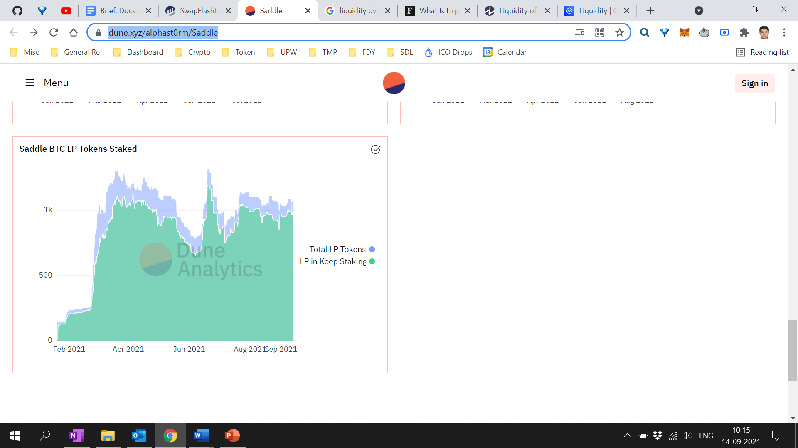

# Saddle Protocol Stats

In this section, we will explain the key stats and the analytics tools available to interpret the protocol stats.

## **SADDLE PROTOCOL STATS**

### **Total Value Locked \(TVL\)**

Total value locked is the funds \(assets\) currently locked \(staked\) in Saddle protocol. TVL represents the total dollar valuation of all the assets deposited in Saddle’s smart contracts.

Live Chart: [https://www.tokenterminal.com/terminal/projects/saddle-finance](https://www.tokenterminal.com/terminal/projects/saddle-finance)

### **Trading Volume \(TV\)**

Trading volume is the number of units traded in the market during a time. For instance, a 24-hour trading volume shows the value of assets bought and sold over the course of a day.

Live Chart: [https://www.tokenterminal.com/terminal/projects/saddle-finance](https://www.tokenterminal.com/terminal/projects/saddle-finance)

### **Total Revenue \(Trading Fees\)**

Total revenue is a measure of the trading fees paid by the traders over a specific period.

Live Chart: [https://www.tokenterminal.com/terminal/projects/saddle-finance](https://www.tokenterminal.com/terminal/projects/saddle-finance)

### **Supply-Side Revenue**

Supply-side revenue is the share of trading fees which go to the liquidity providers \(LPs\) for their contribution to the liquidity pools.

Live Chart: [https://www.tokenterminal.com/terminal/projects/saddle-finance](https://www.tokenterminal.com/terminal/projects/saddle-finance)

### **Revenue Composition**

A chart on asset vs revenue comparison – which asset contributes most to the revenue generated on Saddle.

Live Chart: [https://www.tokenterminal.com/terminal/projects/saddle-finance](https://www.tokenterminal.com/terminal/projects/saddle-finance)

### **Liquidity By Asset**

Liquidity refers to how easily and quickly assets are bought or sold _without_ affecting the asset's price. Assets with a high volume of trade are typically considered liquid.

Live Chart: [https://dune.xyz/alphast0rm/Saddle](https://dune.xyz/alphast0rm/Saddle)

### **LP Tokens Staked**

Saddle rewards LP tokens for contributing to the liquidity pools. Liquidity providers can further stake the LP tokens to earn additional rewards. This stat shows the LP tokens issued vs staked.

Live Chart: [https://dune.xyz/alphast0rm/Saddle](https://dune.xyz/alphast0rm/Saddle)

## **SADDLE POOL STATS**

Besides the protocol stats, many tools are available to understand the technical information around Saddle. In this section, we will explain the key stats and the tools available to interpret the technical stats.

### **Unique Deposit Address**

The unique deposit address denotes the liquidity providers of Saddle. A wide spread of unique addresses is a measure of the fair distribution and mass adoption of the Saddle ecosystem.

Live Chart: [https://dune.xyz/alphast0rm/Saddle](https://dune.xyz/alphast0rm/Saddle)

### **Smart Contract Stats**

By using block explorer tools - like [Etherscan](https://etherscan.io/), [BlockChair](https://blockchair.com/), or [OKLink](https://www.oklink.com/) – users can extract and analyze lots of technical stats around Saddle’s smart contracts. To extract the information, you’ll need the Ethereum address. You’ll find the smart contract address of all Saddle Pools [here](https://docs.saddle.finance/contracts).

In this example, we’ll analyze the stats of the D4 Saddle Pool with the smart contract address: _0xC69DDcd4DFeF25D8a793241834d4cc4b3668EAD6_.

**Etherscan.io Block Explorer**

- **Step 1:** Choose the pool and copy the smart contract address from [here](https://docs.saddle.finance/contracts)
- **Step 2:** Go to [https://etherscan.io/](https://etherscan.io/)
- **Step 3:** Enter the smart contract address in the search box. Click _Search_.
- **Step 4**: You’ll now see the stats of the D4 Saddle Pool

**Blockchair.com Block Explorer**

- **Step 1:** Choose the pool and copy the smart contract address from [here](https://docs.saddle.finance/contracts)
- **Step 2:** Go to [https://blockchair.com/](https://blockchair.com/)
- **Step 3:** Enter the smart contract address in the search box. Click _Search_.
- **Step 4**: You’ll now see the stats of the D4 Saddle Pool

### **Visualizing Smart Contracts**

By using visualization tools - like [Bitquery](https://explorer.bitquery.io/) – users can extract the stats in visual and easily digestible format. To extract the information, you’ll need the Ethereum address. You’ll find the smart contract address of all Saddle Pools [here](https://docs.saddle.finance/contracts).

In this example, we’ll analyze the stats of the D4 Saddle Pool with the smart contract address: _0xC69DDcd4DFeF25D8a793241834d4cc4b3668EAD6_.

**Bitquery.io Block Explorer**

- **Step 1:** Choose the pool and copy the smart contract address from [here](https://docs.saddle.finance/contracts)
- **Step 2:** Go to [https://explorer.bitquery.io/](https://explorer.bitquery.io/)
- **Step 3:** Enter the smart contract address in the search box. Click _Search_.
- **Step 4**: Click on Ethereum Mainnet in the results shown

